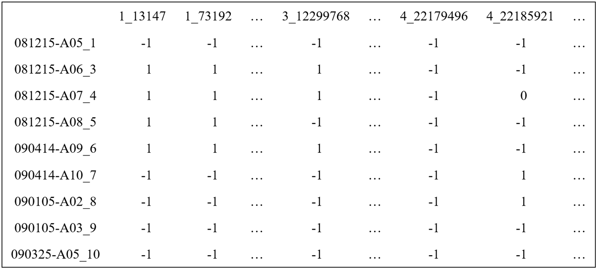
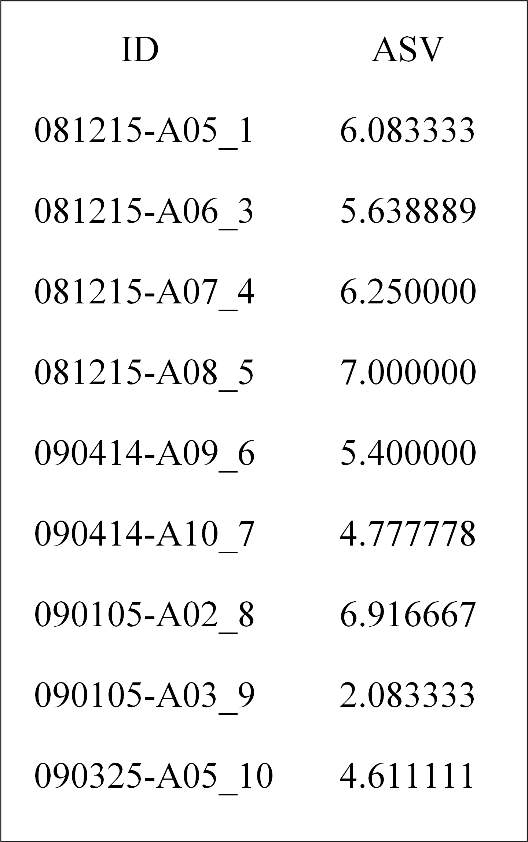
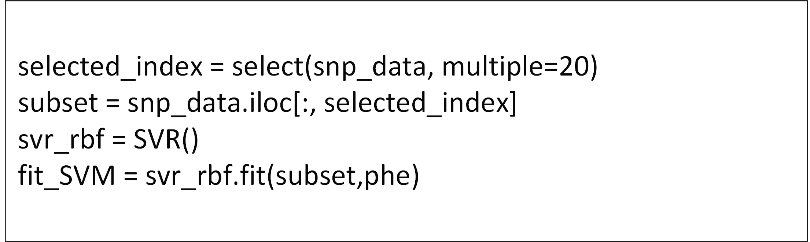
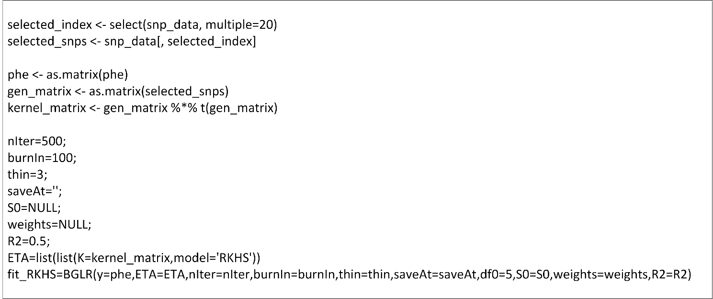

# MDMS: A novel marker selection method for more accurate and efficient genomic selection
The package "markerselection" enables users to apply the Manhattan Distance-based Marker Selection (MDMS) method. It is implemented in both R and Python.

## User manual of the package markerselection

**1. User manual of the Python Package markerselection**

**1.1 Set up the operating environment**
   
(1) To use the MDMS method, you first need to configure the operating environment. Install Anaconda (*https://www.anaconda.com/*) and add it to the system environment. Double-click the downloaded file and follow the instructions on the screen.

(2) Create and configure a virtual environment for running MDMS (for example, name it MDMS, or use a custom name). The Python version should be at least 3.6. The environment can be created with the following commands, using python=3.9 as an example:

*conda create --name MDMS python=3.9.21*

*conda activate MDMS*

The detailed environment configuration is as follows:

*pandas=2.2.3*

*numpy=1.26.4*

*scikit-learn=1.6.1*

**1.2 Install the package markerselection**

Download and unzip the package "markerselection-1.0.0.tar.gz" to your local directory (taking "D:\MDMS\" as an example). After unzipping, it will produce a folder named markerselection-1.0.0. Then activate your conda environment and install the package using the following commands:

*cd D:\MDMS\markerselection-1.0.0*

*pip install .*

**1.3 Preprocess input data**

After setting up the environment and installing the package, you need to preprocess the input data. The input data should be in DataFrame format, with rows presenting samples and columns presenting markers. The input data needs to be preprocessed as follows:

(1) The serial number of each chromosome should be included in the column name as a prefix to the marker position. The column names can use any of the following four format examples: "chr1\_13147", "chr1-13147", "1\_13147", or "1-13147", where "13147" is the original marker position.

(2) Perform numerical encoding on your genotype data. For a marker with two alleles, such as A and a, you can define the genotype scores as 1, 0, and -1 (or other values) for the AA, Aa and aa, respectively. If there are missing values in the marker data, they should be imputed using the mean or other methods.

An example of the marker data used as input is shown in Fig. 1.

**Fig. 1. An input example of the marker data.** The column names in the data are marker positions, prefixed by the serial number of each chromosome. The row names are the sample names.

(3) The phenotypic data input for the genomic selection model be in DataFrame format. An example of the phenotypic data used as input is shown in Fig. 2.

**Fig. 2 An input example of the phenotypic dat**a. "ASV" is the name of a trait. The row names are the sample names.

**1.4 Usage**

In Python, use the following code to import the package:

*from markerselection import selec**t*

The preprocessed marker data for input should be in DataFrame format. The code to use the package is as follow:

*Output\_results = select(marker\_data,* *multiple=20)*

*marker\_data:* The input DataFrame containing processed genotype data.

*multiple (default: 20):* This parameter determines that, given a sufficient number of available markers, the final count of selected markers will approximately equal the sample size multiplied by this value.

The output is a list of selected marker index. Extract the corresponding data from the marker data based on the marker index, and obtain the marker subset. Finally, this marker subset can be used in GS models. A simple example of the SVM model fitting with the marker subset is shown in Fig. 3.

**Fig. 3. An example of applying the marker subset to SVM.** This is a simple code example of applying the marker subset to the SVM model. Here, "snp\_data" is the marker data in DataFrame format that has been preprocessed, and "phe" is phenotypic data in DataFrame format.

**2. User manual of the R Package markerselection**

**2.1 Install R package**

Download the package "markerselection\_1.0.0.tar.gz" to your local directory (taking "D:\MDMS\" as an example). Use the following command to install the package markerselection:

*install.packages("D:/MDMS/markerselection\_1.0.0.tar.gz", repos = NULL, type = "source")*

Run the following command:

*library(markerselection)*

If no errors are displayed, the installation is successful. Additional installation requirements are as follows:

The R version should be at least 4.3.

**2.2 Preprocess input data**

You need to preprocess the input data. The input data should be in DataFrame format, with rows presenting samples and columns presenting markers. The input data needs to be preprocessed as follows:

(1) The serial number of each chromosome should be included in the column name as a prefix to the marker position. The column names can use any of the following four format examples: "chr1\_13147", "chr1-13147", "1\_13147", or "1-13147", where “13147” is the original marker position.

(2) Perform numerical encoding on your genotype data. For a marker with two alleles, such as A and a, you can define the genotype scores as 1, 0, and -1 (or other values) for the AA, Aa and aa, respectively. If there are missing values in the marker data, they should be imputed using the mean or other methods.

An example of the marker data used as input is shown in Fig. 1.

(3) The phenotypic data input for the genomic selection model be in DataFrame format. An example of the phenotypic data used as input is shown in Fig. 2.

**2.3 Usage**

Use the following code to import the package:

*library(markerselection)*

The preprocessed marker data for input should be in DataFrame format. The code to use the package is as follows:

*Output\_*results *<- select(marker\_data,* *multiple=20)*

*marker\_data:* The input DataFrame containing processed genotype data.

*multiple (default: 20):* This parameter determines that, given a sufficient number of available markers, the final count of selected markers will approximately equal the sample size multiplied by this value.

The output is a vector of selected marker index. Extract the corresponding data from the marker data based on the marker index, and obtain the marker subset. Finally, this marker subset can be used in GS models. A simple example of the RKHS model fitting with the marker subset is shown in Fig. 4.

**Fig. 4.** **An example of applying the marker subset to RKHS.** This is a simple code example of applying the marker subset to the RKHS model. Here, "snp\_data" is the marker data in DataFrame format that has been preprocessed, and "phe" is phenotypic data in matrix format.
